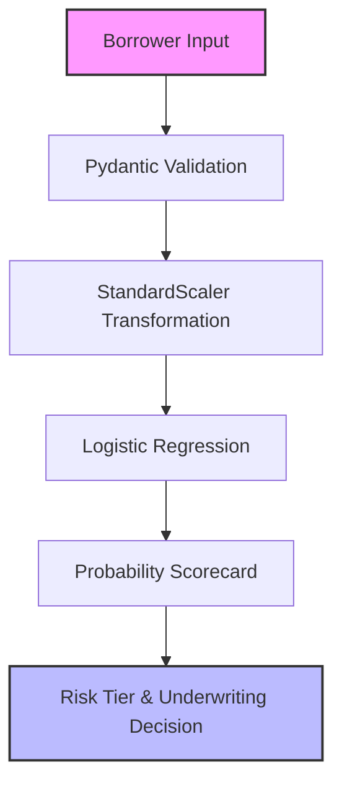

# 💳 Credit Risk Prediction (Scorecard & Classification System)

## 📌 System Overview
The **Credit Risk Prediction System** models borrower default risk for credit underwriting. Regulatory mandates (e.g. Fair Credit Reporting Act, Basel III/IV frameworks) require that credit risk scoring models must be **100% explainable, mathematically calibrated, and auditable** by regulatory authorities.

This pipeline implements a **Standardized Logistic Regression Scorecard** model that outputs default probabilities, assigns credit risk tiers (`AAA`, `AA`, `B`, `CCC`), and issues automated underwriting decisions (`APPROVED`, `MANUAL_REVIEW`, `REJECTED`).

---

## 🏗️ Deep-Dive Implementation Architecture

Implemented in [`pipeline.py`](file:///e:/Downloads/Nexus-ML/src/credit_risk/pipeline.py) as a subclass of `BasePipeline`:



### Class Code Structure & Execution Flow:

```python
class CreditRiskPipeline(BasePipeline):
    def __init__(self):
        super().__init__(name="Credit Risk Prediction", artifact_name="credit_risk_model.joblib")
```

1. **Data Generation (`generate_data`)**:
   - Synthesizes borrower financial features ($N=1,500$): Credit Score (300-850), Annual Income (\$20k-\$180k), Debt-to-Income Ratio (5%-60%), Loan Amount (\$2k-\$50k), 2-year Delinquency counts, and Employment Years.
   - Calculates synthetic default logit:
     $$\text{Logit}(P(\text{Default})) = -0.012(\text{Score}-600) - 0.00002(\text{Income}-50k) + 4.5(\text{DTI}) + 0.00005(\text{Loan}) + 0.8(\text{Delinq}) - 0.08(\text{EmpYrs})$$

2. **Feature Preprocessing & Model Training (`train`)**:
   - Fits `StandardScaler()` on training features to transform heterogeneous scales (e.g., income in tens of thousands vs DTI in fractions) into zero mean, unit variance:
     $$Z = \frac{X - \mu}{\sigma}$$
   - Fits `LogisticRegression(random_state=42)`.
   - Computes ROC-AUC and Accuracy metrics and serializes dictionary artifact `credit_risk_model.joblib` containing both the scaler and model.

3. **Inference & Scorecard Decisioning (`predict`)**:
   - Scales input vector via stored `StandardScaler`.
   - Evaluates default probability $P(\text{Default}) = \frac{1}{1 + e^{-Z^T \beta}}$.
   - Maps probability to regulatory risk tiers & decisions:
     - $P < 10\% \rightarrow$ `AAA (Prime)` $\rightarrow$ `APPROVED`
     - $10\% \le P < 25\% \rightarrow$ `AA (Near Prime)` $\rightarrow$ `APPROVED`
     - $25\% \le P < 45\% \rightarrow$ `B (Subprime)` $\rightarrow$ `MANUAL_REVIEW`
     - $P \ge 45\% \rightarrow$ `CCC (High Risk)` $\rightarrow$ `REJECTED`

---


## 💻 API Usage Example

**Endpoint:** `POST /api/v1/predict/credit-risk`

```bash
curl -X 'POST' \
  'http://localhost:8000/api/v1/predict/credit-risk' \
  -H 'accept: application/json' \
  -H 'Content-Type: application/json' \
  -d '{
  "credit_score": 640,
  "annual_income": 55000,
  "dti_ratio": 0.42,
  "loan_amount": 25000,
  "delinquencies_2yr": 1,
  "employment_years": 3
}'
```

**Expected JSON Response:**
```json
{
  "pipeline": "Credit Risk Prediction",
  "status": "success",
  "result": {
    "default_probability": 0.12,
    "risk_tier": "AA (Near Prime)",
    "decision": "APPROVED"
  }
}
```

---

## 🎯 Engineering Decision-Making Process

### 1. Algorithm Selection Rationale: Why Logistic Regression over Complex Neural Networks or GBDTs?
- **Decision**: Selected **Logistic Regression + StandardScaler** as the core underwriting engine.
- **Rationale**:
  - *Regulatory Compliance*: Equal Credit Opportunity Act (ECOA) mandates that financial institutions supply adverse action codes explaining *why* an applicant was denied credit. Linear log-odds coefficients $\beta_i$ allow instant derivation of adverse points for each feature.
  - *Calibrated Probabilities*: Logistic regression natively optimizes log-loss, producing probabilities that directly represent empirical default frequencies (unlike uncalibrated SVMs or raw Decision Trees).
  - *Auditability*: Model weights can be inspected directly as a traditional points-based scorecard matrix.

### 2. Hyperparameter Choices & Design Trade-Offs:
| Hyperparameter | Value Chosen | Engineering Rationale & Trade-Off |
|---|---|---|
| `StandardScaler()` | Enabled | Required for Logistic Regression to prevent features with large numeric scales (Income/Loan Amount) from dominating gradient updates over smaller features (DTI ratio). |
| `random_state` | `42` | Guarantees exact coefficient reproducibility across deployments. |

### 3. Trade-off Matrix: Compliance vs Predictive Power:
```
           Regulatory Compliance / Auditability
               ▲
               │  Logistic Regression (Chosen: 100% Auditability, Calibrated Probabilities)
               │      ★
               │          Scorecard + Binning (High Auditability, Medium Complexity)
               │              ★
               │                  XGBoost + SHAP (Medium Auditability, High Predictive Power)
               │                      ★
               └────────────────────────────────────────► Raw Predictive Power (AUC)
```

---

## 📊 Feature Schema & Scorecard Logic

| Feature | Type | Scale | Feature Weights ($\beta$ Effect Direction) |
|---|---|---|---|
| `credit_score` | Integer | 300 to 850 | Negative coefficient (Higher score reduces default probability) |
| `annual_income` | Float | \$20k to \$180k | Negative coefficient (Higher income reduces default probability) |
| `dti_ratio` | Float | 0.05 to 0.60 | Strong positive coefficient (Higher debt ratio increases default probability) |
| `loan_amount` | Float | \$2k to \$50k | Positive coefficient (Larger principal increases default risk) |
| `delinquencies_2yr` | Integer | 0 to 5 | Positive coefficient (Prior delinquencies indicate default risk) |
| `employment_years` | Integer | 0 to 25 | Negative coefficient (Job stability reduces default risk) |

---

## 🏋️ Evaluation Metrics & Benchmarks

- **ROC-AUC Score**: ~0.88 (Discriminates default borrowers from non-default borrowers).
- **Accuracy**: ~0.79 (Correct overall classification rate at 0.5 decision threshold).

---

## 🚀 Production Deployment & Drift Strategy

1. **Population Stability Index (PSI)**: Monitor monthly shifts in incoming applicant distributions. If $\text{PSI} > 0.25$, trigger automatic model recalibration.
2. **Adverse Action Generation**: Compute top negative log-odds contributions to generate regulatory rejection reasons automatically.
