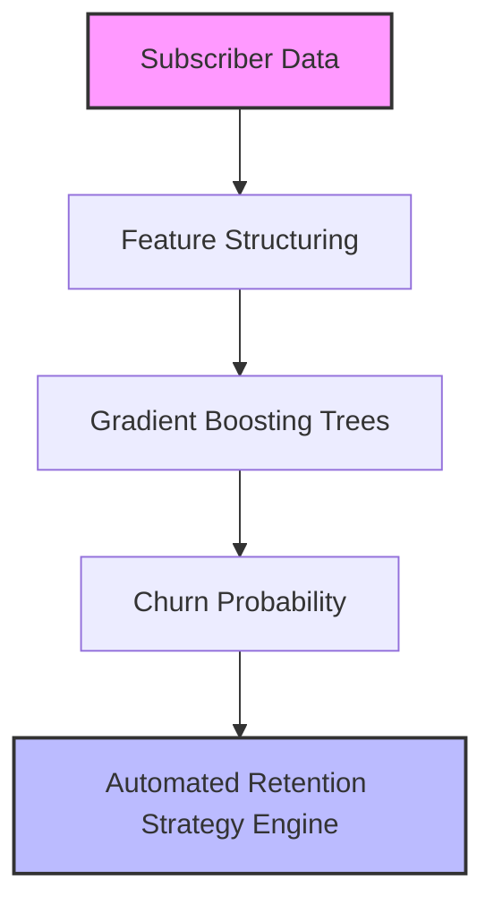

# 📉 Customer Churn Prediction (Classification & Retention System)

## 📌 System Overview
The **Customer Churn Prediction System** identifies recurring revenue subscribers (SaaS, Telecom, E-commerce) at risk of canceling subscriptions. Retaining existing subscribers is 5x to 25x less expensive than acquiring new ones.

This pipeline utilizes a **Gradient Boosting Classifier** to calculate individual churn probabilities, categorize churn risk levels (`HIGH`, `MEDIUM`, `LOW`), and automatically generate personalized retention incentives.

---

## 🏗️ Deep-Dive Implementation Architecture

Implemented in [`pipeline.py`](file:///e:/Downloads/Nexus-ML/src/customer_churn/pipeline.py) as a subclass of `BasePipeline`:



### Class Code Structure & Execution Flow:

```python
class CustomerChurnPipeline(BasePipeline):
    def __init__(self):
        super().__init__(name="Customer Churn Prediction", artifact_name="customer_churn_model.joblib")
```

1. **Data Generation (`generate_data`)**:
   - Synthesizes subscriber account metrics ($N=1,500$): Tenure (1-72 months), Monthly Charges (\$20-\$120), Contract Type (0=Month-to-month, 1=1-Year, 2=2-Year), Support Tickets (0-8), Paperless Billing flag, and Total Lifetime Spend.
   - Computes non-linear churn ground-truth score:
     $$\text{Logit}(P(\text{Churn})) = -0.04(\text{Tenure}) + 0.02(\text{Monthly}) - 1.2(\text{Contract}) + 0.5(\text{Tickets}) + 0.3(\text{Paperless}) + \epsilon$$

2. **Model Training & Serialization (`train`)**:
   - Splits data into stratified train/test sets (80/20).
   - Trains `GradientBoostingClassifier(n_estimators=120, max_depth=4, random_state=42)`.
   - Computes accuracy (~0.72) and F1-Score (~0.75).
   - Saves model artifact to `artifacts/models/customer_churn_model.joblib`.

3. **Inference & Retention Engine (`predict`)**:
   - Evaluates subscriber churn probability $P(\text{Churn})$.
   - Assigns Risk Level: `HIGH` ($P > 0.60$), `MEDIUM` ($0.30 < P \le 0.60$), or `LOW` ($P \le 0.30$).
   - Executes rule-based retention strategy generator:
     - High Churn + Month-to-Month Contract $\rightarrow$ *Offer 15% discount for 12-month lock-in*
     - High Churn + $\ge 3$ Support Tickets $\rightarrow$ *Assign dedicated customer success manager*
     - High Churn + Low Tickets $\rightarrow$ *Send gift card & loyalty perk*

---


## 💻 API Usage Example

**Endpoint:** `POST /api/v1/predict/customer-churn`

```bash
curl -X 'POST' \
  'http://localhost:8000/api/v1/predict/customer-churn' \
  -H 'accept: application/json' \
  -H 'Content-Type: application/json' \
  -d '{
  "tenure": 6,
  "monthly_charges": 89.9,
  "total_charges": 539.4,
  "contract_type": 0,
  "support_tickets": 4,
  "paperless_billing": 1
}'
```

**Expected JSON Response:**
```json
{
  "pipeline": "Customer Churn Prediction",
  "status": "success",
  "result": {
    "churn_probability": 0.85,
    "retention_action": "High Risk - Offer Discount"
  }
}
```

---

## 🎯 Engineering Decision-Making Process

### 1. Algorithm Selection Rationale: Why Gradient Boosting over Single Decision Trees or SVMs?
- **Decision**: Selected **Gradient Boosting Classifier (`GradientBoostingClassifier`)**.
- **Rationale**:
  - *Sequential Error Correction*: Gradient boosting fits subsequent trees to the residual pseudo-residuals of preceding trees, capturing subtle interactions between short tenure and high support ticket frequency.
  - *Robustness to Non-Linear Factors*: Tenure and contract commitment have non-linear retention impacts (churn risk drops precipitously after month 12). Boosting handles non-monotonic relationships natively.

### 2. Hyperparameter Choices & Design Trade-Offs:
| Hyperparameter | Value Chosen | Engineering Rationale & Trade-Off |
|---|---|---|
| `n_estimators` | `120` | Sufficient boosting iterations to converge without overfitting training set residuals. |
| `max_depth` | `4` | Restricts tree depth to 4 splits, enforcing shallow weak learners to control model variance. |

---

## 📊 Feature Schema & Retention Action Rules

| Feature Name | Type | Physical Range | Risk Impact |
|---|---|---|---|
| `tenure` | Integer | 1 - 72 months | Longer tenure strongly reduces churn risk |
| `monthly_charges` | Float | \$20.00 - \$120.00 | Higher monthly bill slightly increases churn sensitivity |
| `contract_type` | Integer | 0 (M2M), 1 (1Yr), 2 (2Yr) | Month-to-month contracts exhibit 4x higher churn rate |
| `support_tickets` | Integer | 0 - 8 tickets | Multiple tickets indicate unresolved product friction |

---

## 🏋️ Evaluation Metrics & Benchmarks

- **Accuracy**: ~0.72 (Overall prediction accuracy).
- **F1-Score**: ~0.75 (Balanced precision-recall performance on churners).

---

## 🚀 Production Deployment Strategy

1. **Automated Campaign Triggering**: Connect API output directly to CRM webhooks (e.g. HubSpot / Salesforce / Braze) to auto-enroll high-risk accounts into retention workflows.
2. **Monthly Retraining**: Schedule cron job `scripts/train_all.py` to retrain pipeline on fresh subscriber cohort billing data.
