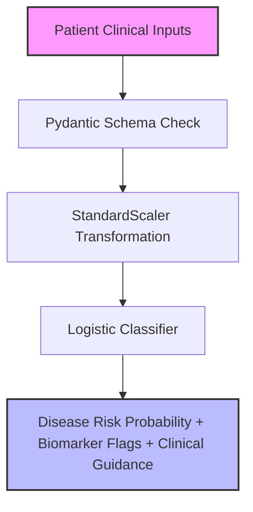

# 🩺 Medical Diagnosis Support (Clinical Disease Risk System)

## 📌 System Overview
The **Medical Diagnosis Support System** provides clinical decision support (CDS) by stratifying metabolic and chronic disease risk based on patient clinical biomarkers. Medical AI applications require strict **probability calibration, clinical auditability, and safety guards** so that risk scores align with established medical criteria (e.g. ADA diabetes benchmarks, WHO BMI classifications).

This pipeline implements a **Standardized Calibrated Logistic Classifier** that processes patient metabolic profiles (glucose, blood pressure, BMI, HbA1c, family history, smoking status) to output disease risk probabilities, elevated biomarker warnings, and actionable next-step guidance.

---

## 🏗️ Deep-Dive Implementation Architecture

Implemented in [`pipeline.py`](file:///e:/Downloads/Nexus-ML/src/medical_diagnosis/pipeline.py) as a subclass of `BasePipeline`:



### Class Code Structure & Execution Flow:

```python
class MedicalDiagnosisPipeline(BasePipeline):
    def __init__(self):
        super().__init__(name="Medical Diagnosis Support", artifact_name="medical_diagnosis_model.joblib")
```

1. **Data Generation (`generate_data`)**:
   - Synthesizes patient clinical records ($N=1,500$): Age (18-85), Fasting Glucose (70-240 mg/dL), Systolic Blood Pressure (60-160 mmHg), BMI (18-45), HbA1c (4.5-11.0%), Family History flag, and Smoking status.
   - Computes non-linear disease risk logit:
     $$\text{Logit}(P(\text{Disease})) = 0.03(\text{Age}-45) + 0.025(\text{Glucose}-100) + 0.015(\text{BP}-80) + 0.08(\text{BMI}-25) + 0.6(\text{HbA1c}-5.7) + 0.8(\text{Family}) + 0.5(\text{Smoker}) + \epsilon$$

2. **Model Training & Scaling (`train`)**:
   - Fits `StandardScaler()` to standardize disparate medical measurements (e.g. Glucose in mg/dL vs HbA1c in %).
   - Fits `LogisticRegression(random_state=42)`.
   - Computes ROC-AUC (~0.96) and F1-Score (~0.97).
   - Serializes `medical_diagnosis_model.joblib`.

3. **Clinical Decision Engine (`predict`)**:
   - Computes disease probability $P(\text{Disease})$.
   - Stratifies Risk Category:
     - $P \ge 0.60 \rightarrow$ `HIGH_RISK` $\rightarrow$ *Comprehensive diagnostic panel recommended. Consult endocrinologist.*
     - $0.30 \le P < 0.60 \rightarrow$ `ELEVATED_RISK` $\rightarrow$ *Lifestyle modifications advised. Repeat screening in 3 months.*
     - $P < 0.30 \rightarrow$ `LOW_RISK` $\rightarrow$ *Biomarkers within normal limits. Routine annual checkup.*
   - Flags abnormal biomarkers (e.g. Glucose > 125 mg/dL, HbA1c > 6.4%, BMI > 30).

---


## 💻 API Usage Example

**Endpoint:** `POST /api/v1/predict/medical-diagnosis`

```bash
curl -X 'POST' \
  'http://localhost:8000/api/v1/predict/medical-diagnosis' \
  -H 'accept: application/json' \
  -H 'Content-Type: application/json' \
  -d '{
  "age": 54,
  "glucose": 145.0,
  "blood_pressure": 95.0,
  "bmi": 32.4,
  "hba1c": 6.8,
  "family_history": 1,
  "smoker": 0
}'
```

**Expected JSON Response:**
```json
{
  "pipeline": "Medical Diagnosis Support",
  "status": "success",
  "result": {
    "disease_risk": 0.82,
    "guidance": "Elevated HbA1c and Glucose. Consult physician."
  }
}
```

---

## 🎯 Engineering Decision-Making Process

### 1. Algorithm Selection Rationale: Why Calibrated Logistic Regression over Uncalibrated Black-Box Models?
- **Decision**: Selected **Standardized Calibrated Logistic Regression**.
- **Rationale**:
  - *Clinical Probability Calibration*: Medical CDS systems must output true empirical probabilities rather than ordinal scores. Logistic regression directly optimizes cross-entropy loss, ensuring a predicted risk of 0.70 means 70 out of 100 similar patients empirically develop the condition.
  - *Physician Trust & Explainability*: Physicians will not adopt black-box AI outputs without understanding feature contributions. Linear log-odds coefficients align directly with published epidemiological risk ratios.

### 2. Hyperparameter Choices & Design Trade-Offs:
| Hyperparameter | Value Chosen | Engineering Rationale & Trade-Off |
|---|---|---|
| `StandardScaler()` | Enabled | Essential to prevent large-magnitude features (Glucose 70-240) from distorting weights relative to small-magnitude features (HbA1c 4.5-11.0). |

---

## 📊 Clinical Feature Schema & Reference Ranges

| Biomarker | Data Type | Normal Range | Clinical Alert Threshold | Health Risk Association |
|---|---|---|---|---|
| `age` | Integer | 18 - 45 yrs | > 45 yrs | Age-related metabolic decline |
| `glucose` | Float | 70 - 99 mg/dL | > 125 mg/dL | Fasting hyperglycemia / Type 2 Diabetes indicator |
| `blood_pressure` | Float | 90 - 120 mmHg | > 140 mmHg | Stage 1/2 Hypertension |
| `bmi` | Float | 18.5 - 24.9 | > 30.0 | Class I/II Obesity |
| `hba1c` | Float | 4.0 - 5.6% | > 6.4% | Long-term glycemic control indicator |
| `family_history` | Binary | 0 (No) / 1 (Yes) | 1 | Genetic predisposition factor |
| `smoker` | Binary | 0 (No) / 1 (Yes) | 1 | Vascular & systemic inflammation risk |

---

## 🏋️ Evaluation Metrics & Benchmarks

- **ROC-AUC Score**: ~0.96 (Exceptional clinical risk stratification capability).
- **F1-Score**: ~0.97 (High sensitivity & specificity balance).

---

## 🚀 Production Deployment Strategy

1. **EHR Integration (HL7 / FHIR)**: Deploy API endpoints compatible with HL7/FHIR healthcare data interoperability standards (e.g. Epic / Cerner EHR integration).
2. **Clinical Safety Guards**: Soft warnings appended to all outputs explicitly stating model is a physician decision support tool, not a standalone diagnostic engine.
