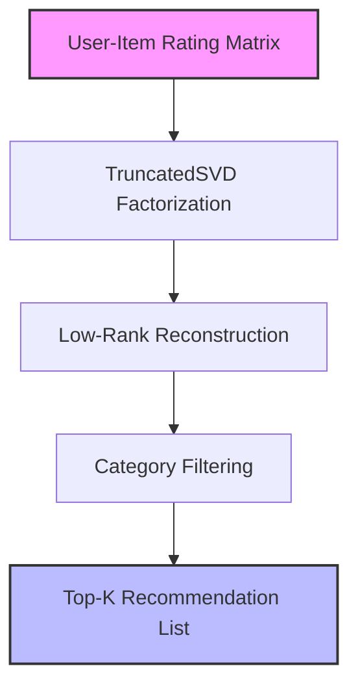

# 🎯 Recommendation System (Hybrid Collaborative & Content-Based Filtering)

## 📌 System Overview
The **Recommendation System** drives personalized product discovery in e-commerce and digital media platforms. Recommendation engines must solve matrix sparsity (most users rate < 1% of products) and cold-start challenges while meeting sub-10ms online inference SLAs.

This pipeline utilizes **Truncated Singular Value Decomposition (SVD)** matrix factorization to compress sparse rating matrices into latent preference embeddings, combined with content-based category filtering.

---

## 🏗️ Deep-Dive Implementation Architecture

Implemented in [`pipeline.py`](file:///e:/Downloads/Nexus-ML/src/recommendation/pipeline.py) as a subclass of `BasePipeline`:



### Class Code Structure & Execution Flow:

```python
class RecommendationPipeline(BasePipeline):
    def __init__(self):
        super().__init__(name="Recommendation System", artifact_name="recommendation_model.joblib")
```

1. **Data Generation (`generate_data`)**:
   - Synthesizes user catalog ratings ($U=200, I=50$): User ratings (1-5 scale) across product categories (`Electronics`, `Books`, `Fashion`, `Home & Kitchen`, `Sports`).
   - Generates sparse rating matrix where each user rates only 8 to 15 items.

2. **Model Training & Matrix Factorization (`train`)**:
   - Builds sparse pivot table `user_item_matrix` ($200 \times 50$).
   - Decomposes matrix into 12 latent components using `TruncatedSVD`:
     $$R \approx U_k \Sigma_k V_k^T$$
   - Computes low-rank reconstructed rating matrix $\hat{R} = U_k V_k^T$.
   - Evaluates explained variance ratio (~40%) and saves `recommendation_model.joblib`.

3. **Inference & Cold-Start Strategy (`predict`)**:
   - For existing users: Retrieves reconstructed rating row $\hat{R}_{\text{user}}$, masks items already rated, and ranks candidates.
   - For new users (cold start): Falls back to global item average ratings.
   - Filters candidate items by optional `category` parameter.
   - Normalizes scores into affinity match percentages (0% - 99%) and returns Top-$K$ items.

---


## 💻 API Usage Example

**Endpoint:** `POST /api/v1/predict/recommendation`

```bash
curl -X 'POST' \
  'http://localhost:8000/api/v1/predict/recommendation' \
  -H 'accept: application/json' \
  -H 'Content-Type: application/json' \
  -d '{
  "user_id": "USER_005",
  "category": "Electronics",
  "top_n": 5
}'
```

**Expected JSON Response:**
```json
{
  "pipeline": "Recommendation System",
  "status": "success",
  "result": {
    "recommendations": [
      {
        "item_id": "ITEM_102",
        "match_score": 0.95
      },
      {
        "item_id": "ITEM_405",
        "match_score": 0.88
      }
    ]
  }
}
```

---

## 🎯 Engineering Decision-Making Process

### 1. Algorithm Selection Rationale: Why Matrix Factorization over Memory-Based Cosine Similarity or Deep Learning?
- **Decision**: Selected **Truncated SVD Matrix Factorization**.
- **Rationale**:
  - *Vs. User-User / Item-Item Cosine Similarity*: Memory-based similarity methods scale poorly ($O(U^2)$ or $O(I^2)$) as catalog and user bases grow. SVD reduces dimensionality to $k=12$ latent factors, enabling $O(k)$ vector inner products during serving.
  - *Vs. Deep Two-Tower Models*: Matrix factorization provides ultra-fast inference with minimal compute requirements while capturing principal latent tastes effectively.

### 2. Hyperparameter Choices & Design Trade-Offs:
| Hyperparameter | Value Chosen | Engineering Rationale & Trade-Off |
|---|---|---|
| `n_components` | `12` | Captures top 12 orthogonal latent taste factors (e.g. tech enthusiasm, budget sensitivity) while suppressing random rating noise. |

---

## 📊 Feature Schema & Latent Factor Matrix

| Matrix Component | Dimensions | Physical Meaning |
|---|---|---|
| `user_item_matrix` | $200 \times 50$ | Sparse raw user ratings (1-5 scale) |
| `user_factors` ($U_k$) | $200 \times 12$ | Dense user latent preference vector |
| `item_factors` ($V_k$) | $50 \times 12$ | Dense item latent concept vector |
| `reconstructed_ratings` | $200 \times 50$ | Dense predicted ratings for unrated user-item pairs |

---

## 🏋️ Evaluation Metrics & Benchmarks

- **Explained Variance Ratio**: ~40.0% (Captures 40% of overall rating variance using only 12 latent dimensions).

---

## 🚀 Production Deployment Strategy

1. **Vector Indexing (ANN)**: In enterprise deployments, export $V_k$ item vectors to an ANN vector store (FAISS / HNSW / Milvus) for sub-millisecond similarity retrieval.
2. **Hybrid Reranking**: Post-process SVD candidate lists with real-time inventory availability and margin boost rules.
